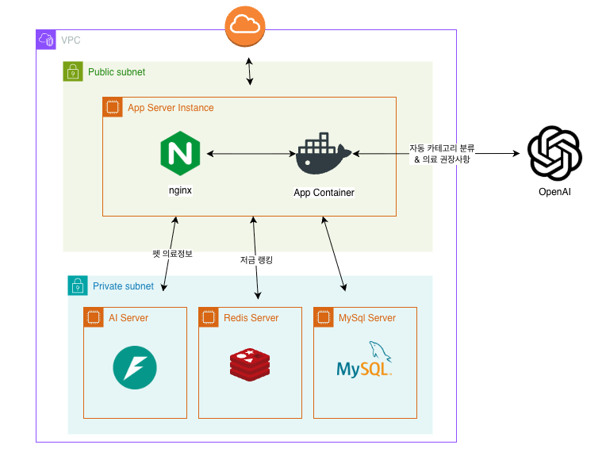
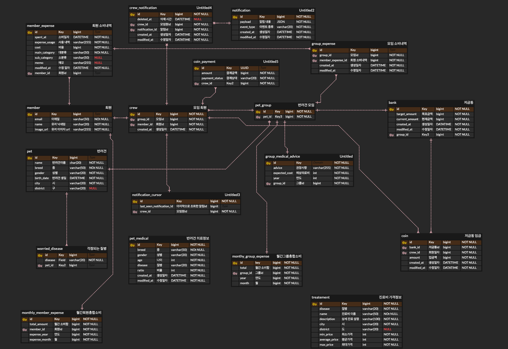

# Backend (Spring)

## 서비스 아키텍처

## ERD

## 🧪 연구소 - 함께 탐구했던 기술 주제

| # | 연구주제 | 기간 | 링크                                                                                                                                                                                                                                                                                                                                                  |
|---|----------|------|-----------------------------------------------------------------------------------------------------------------------------------------------------------------------------------------------------------------------------------------------------------------------------------------------------------------------------------------------------|
| 1 | 옵티마이저는 왜 이 인덱스를 선택했을까: 1억 행 쿼리 실험기 | 2.9 ~ 2.10 | [바로가기](https://github.com/softeerbootcamp-7th/WEB-Team5-Moong/wiki/%5BBE%E2%80%90%EC%97%B0%EA%B5%AC%EC%86%8C%5D-%EC%98%B5%ED%8B%B0%EB%A7%88%EC%9D%B4%EC%A0%80%EB%8A%94-%EC%99%9C-%EC%9D%B4-%EC%9D%B8%EB%8D%B1%EC%8A%A4%EB%A5%BC-%EC%84%A0%ED%83%9D%ED%96%88%EC%9D%84%EA%B9%8C:-1%EC%96%B5-%ED%96%89-%EC%BF%BC%EB%A6%AC-%EC%8B%A4%ED%97%98%EA%B8%B0) |
| 2 | 분산환경 동시성 처리를 위한 4가지 방안 비교 | 2.16 ~ 2.19 | [바로가기](https://github.com/softeerbootcamp-7th/WEB-Team5-Moong/wiki/%5BBE-%E2%80%90-%EC%97%B0%EA%B5%AC%EC%86%8C%5D-%EB%B6%84%EC%82%B0%ED%99%98%EA%B2%BD-%EB%8F%99%EC%8B%9C%EC%84%B1-%EC%B2%98%EB%A6%AC%EB%A5%BC-%EC%9C%84%ED%95%9C-4%EA%B0%80%EC%A7%80-%EB%B0%A9%EC%95%88-%EB%B9%84%EA%B5%90)                                                        |

## 🗂️ 팀원별 Leading Task

### 🧑‍💻 건우

| 학습 태스크 | 링크 |
|------------|------|
| Bulk Insert를 스트림으로 전환하여 GC 프레셔를 줄인 이야기 | [바로가기](https://github.com/softeerbootcamp-7th/WEB-Team5-Moong/wiki/%5BBE%5D-Bulk-Insert%EB%A5%BC-%EC%8A%A4%ED%8A%B8%EB%A6%BC%EC%9C%BC%EB%A1%9C-%EC%A0%84%ED%99%98%ED%95%98%EC%97%AC-GC-%ED%94%84%EB%A0%88%EC%85%94%EB%A5%BC-%EC%A4%84%EC%9D%B8-%EC%9D%B4%EC%95%BC%EA%B8%B0) |
| AI 자동 카테고리 분류 : LLM 응답을 커스텀 역직렬화 & 응답시간 준수 전략 | [바로가기](https://github.com/softeerbootcamp-7th/WEB-Team5-Moong/wiki/%5BBE%5D-%EC%9E%90%EB%8F%99-%EC%B9%B4%ED%85%8C%EA%B3%A0%EB%A6%AC-%EB%B6%84%EB%A5%98-1%EC%B0%A8-%EA%B5%AC%ED%98%84-:-%EC%BB%A4%EC%8A%A4%ED%85%80-%EC%A0%9C%EB%84%A4%EB%A6%AD-%EC%97%AD%EC%A7%81%EB%A0%AC%ED%99%94-&-%EC%9D%91%EB%8B%B5%EC%8B%9C%EA%B0%84-%EC%A4%80%EC%88%98-%EC%A0%84%EB%9E%B5) |
| 동적 쿼리 페이징 최적화 (Page → Slice → Cursor) | [바로가기](https://github.com/softeerbootcamp-7th/WEB-Team5-Moong/wiki/%5BBE%5D-%EB%8F%99%EC%A0%81%EC%BF%BC%EB%A6%AC-%ED%8E%98%EC%9D%B4%EC%A7%95-%EC%B5%9C%EC%A0%81%ED%99%94-(Page-%E2%86%92-Slice-%E2%86%92-Cursor)) |

### 🧑‍💻 현민

| 학습 태스크 | 링크 |
|------------|------|
| 실시간 알림 시스템 설계 (SSE 선택 배경 및 Pub Sub 적용) | [바로가기](https://github.com/softeerbootcamp-7th/WEB-Team5-Moong/wiki/%5BBE%5D-%EC%8B%A4%EC%8B%9C%EA%B0%84-%EC%95%8C%EB%A6%BC-%EC%8B%9C%EC%8A%A4%ED%85%9C-%EC%84%A4%EA%B3%84-(SSE-%EC%84%A0%ED%83%9D-%EB%B0%B0%EA%B2%BD-%EB%B0%8F-Pub-Sub-%EC%A0%81%EC%9A%A9)) |
| SSE 연결 관리에서 마주한 두 가지 문제 | [바로가기](https://github.com/softeerbootcamp-7th/WEB-Team5-Moong/wiki/%5BBE%5D-SSE-%EC%97%B0%EA%B2%B0-%EA%B4%80%EB%A6%AC%EC%97%90%EC%84%9C-%EB%A7%88%EC%A3%BC%ED%95%9C-%EB%91%90-%EA%B0%80%EC%A7%80-%EB%AC%B8%EC%A0%9C) |
| 결제 승인 과정에서의 트랜잭션 경계 설계 | [바로가기](https://github.com/softeerbootcamp-7th/WEB-Team5-Moong/wiki/%5BBE%5D-%EA%B2%B0%EC%A0%9C-%EC%8A%B9%EC%9D%B8-%EA%B3%BC%EC%A0%95%EC%97%90%EC%84%9C%EC%9D%98-%ED%8A%B8%EB%9E%9C%EC%9E%AD%EC%85%98-%EA%B2%BD%EA%B3%84-%EC%84%A4%EA%B3%84) |

### 🧑‍💻 연진

## 👥 팀원별 PR & Wiki

| 팀원 | PR 목록 | Wiki |
|------|---------|------|
| 🧑‍💻 건우 | [🔎 PR 목록 보기](https://github.com/softeerbootcamp-7th/WEB-Team5-Moong/pulls?q=assignee%3Acoli-geonwoo+) | [📚 Wiki 문서 보기](https://github.com/softeerbootcamp-7th/WEB-Team5-Moong/wiki/%F0%9F%91%A8%E2%80%8D%F0%9F%92%BB-%EA%B1%B4%EC%9A%B0's-wiki) |
| 🧑‍💻 현민 | [🔎 PR 목록 보기](https://github.com/softeerbootcamp-7th/WEB-Team5-Moong/pulls?q=assignee%3Ajoyjhm) | [📚 Wiki 문서 보기](https://github.com/softeerbootcamp-7th/WEB-Team5-Moong/wiki/%F0%9F%91%A8%E2%80%8D%F0%9F%92%BB-%ED%98%84%EB%AF%BC's-Wiki) |
| 🧑‍💻 연진 | [🔎 PR 목록 보기](https://github.com/softeerbootcamp-7th/WEB-Team5-Moong/pulls?q=assignee%3AyeonjinJoo) | [📚 Wiki 문서 보기](https://github.com/softeerbootcamp-7th/WEB-Team5-Moong/wiki/%F0%9F%91%A9%E2%80%8D%F0%9F%92%BB-%EC%97%B0%EC%A7%84's-Wiki) |

## 🤝 컨벤션 & 협업

| 항목 | 링크 |
|------|------|
| 코드 스타일 컨벤션 | [Link](https://github.com/softeerbootcamp-7th/WEB-Team5-Moong/wiki/%5BBE%5D-%EC%BD%94%EB%93%9C-%EC%8A%A4%ED%83%80%EC%9D%BC-%EC%BB%A8%EB%B2%A4%EC%85%98) |
| 코드 리뷰 룰 | [Link](https://cheddar-parade-d79.notion.site/Moong-30f3b0d6b355803687dde717168b3a1a?source=copy_link) |

## ✅ Test

- 📋 **테스트 코드 컨벤션** — 팀 테스트 작성 규칙 및 컨벤션 [바로가기](https://cheddar-parade-d79.notion.site/Moong-30f3b0d6b35580ea8758da49da933b5d?pvs=73)
- ✅ **Jacoco Coverage Report** — 전체 커버리지 **74%** 달성 [바로가기](https://softeerbootcamp-7th.github.io/WEB-Team5-Moong/jacoco/index.html)
- 🧾 **Test Result Report** — 총 **316개** 테스트 통과 [바로가기](https://softeerbootcamp-7th.github.io/WEB-Team5-Moong/test/index.html)
